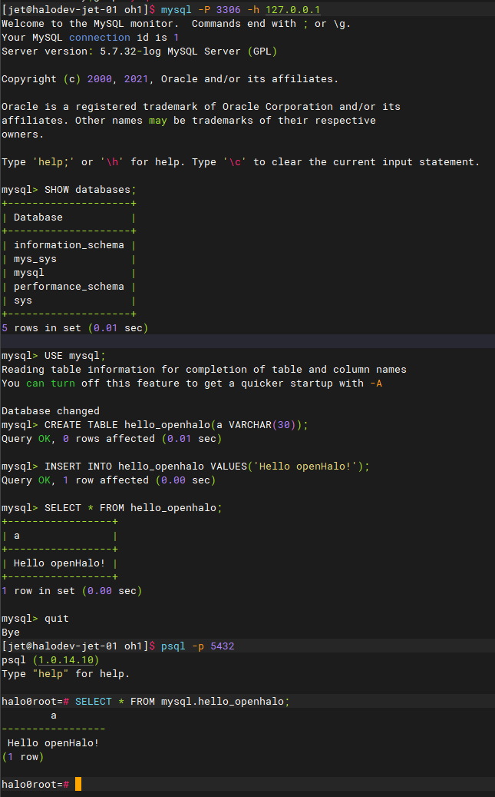

#  openHalo
openHalo provides the capability for PostgreSQL to work with applications written for MySQL but provides much more better performance than MySQL!

Migrating from legacy MySQL databases can be time-consuming and resource-intensive. When migrating your databases, you can automate the migration of your database schema and data using HMT (an opensource migration tool also opened by HaloLab, https://github.com/HaloLab001/hmt-web), but there is often more work to do to migrate the application itself, including re-writing application code that interacts with the database.

openHalo understands the SQL dialect of MySQL, and supports the same communications protocol, so your apps that were originally written for MySQL can work with openHalo with fewer code changes. As a result, the effort required to modify and move applications running on MySQL 5.7 or newer to openHalo is reduced, leading to faster, lower-risk, and more cost-effective migrations.


### Benefits
#### Reduce migration time and risk
openHalo supports commonly used MySQL dialect and semantics which reduces the amount of code changes related to database calls in an application. As a result, the amount of application code you need to re-write is minimized, reducing the risk of any new application errors.

#### Obtain better performance
With openHalo, you can obtain better performance without any extra efforts and fees! Especially for complex SQL statements!

#### Migrate at your own pace
With openHalo, you can commonly-used MySQL query tools, commands, and drivers. As a result, you can continue developing with the tools you are familiar with.


### How it works
openHalo supports commonly used SQL dialect and communication protocol of MySQL. You can use openHalo as a MySQL and enabling your legacy applications to communicate with openHalo without extensive code re-writes but provides much more better performance than MySQL!


### Quick Tutorial
#### Installation from Source Code
- uuid is mandatory.

```sh
./configure --prefix=/home/halo/openhalo/1.0 --enable-debug --with-uuid=ossp CFLAGS=-O2
make && make install
cd contrib
make && make install
```

#### Server Setup
- Create User & User Group
```sh
groupadd –g 1000 halo
useradd –u 1000 –g halo halo
```

- Setup Environment Variables
```sh
export HALO_HOME=/home/halo/openhalo/1.0
export PGDATA=/home/halo/ohdata
export PATH=$HALO_HOME/bin:$PATH
export LD_LIBRARY_PATH=$HALO_HOME/lib
export PGHOST=/var/run/openhalo
```

- Initialize Database
```sh
pg_ctl init -D $PGDATA
```

- Server Configuration
```
...
database_compat_mode = 'mysql'                 # database compat mode, values can be:
                                               # mysql (mysql mode)
                                               # postgresql (default)

mysql.listener_on = true                       # (enable MySQL listener; change requires restart)
mysql.port = 3306                              # (port for MySQL; change requires restart)
...
```

- Start & Initialize MySQL Environment
```sql
psql -p 5432

# CREATE EXTENSION aux_mysql CASCADE;
```

- Query Database using mysql CLI
```sh
mysql -P 3306 -h 127.0.0.1 
```


Halo, HaloBase are trademarks of Halo Tech Co.,Ltd. <br/>
openHalo is a trademark of Halo Tech Co.,Ltd. <br/>
openHalo official website: https://www.openhalo.org
